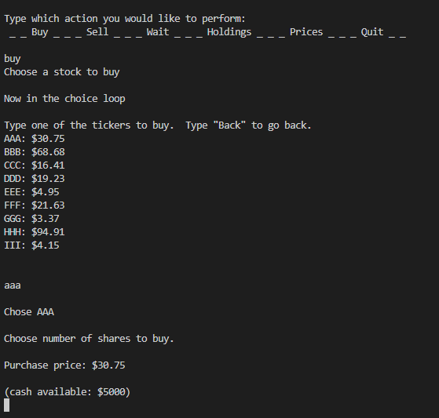

# Stock Game
  ## Description
  The Stock Game is a text-based, command line driven game that allows users to try to amass the largest portfolio they can.  Players can select from a variety of fictional
  stocks to buy and choose when to sell, each turn having a random movement adjust the prices of each stock.

  ## License
  

  ## Table of Contents
  1. [Installation](#Installation)
  2. [Deployment](#Deployment)
  3. [Usage](#Usage)
  4. [Screenshot](#Screenshot)
  5. [Contributing](#Contributing)
  6. [Technologies](#Technologies)
  7. [Tests](#Tests)
  8. [Questions](#Questions)

  ## Installation
  To install this project, install the Main.py file from the GitHub repository (along with any necessary Python interpreter and IDE of your preference), then run Main.py locally and type your responses in the command line.

  ## Deployment
  No Deployment for this application

  ## Usage
    Each turn, players are prompted with a list of possible actions.  Typing in the command line informs the program which to do, and will keep track of the player's progress by
    continuously calculating and updating portfolio balances.  Players can choose to inspect market prices for each stock, buy or sell a stock, or wait and let the market prices
    update.  Taking an action will cause markets to update, so players are constantly faced with the option to buy or sell at differing prices.  Stocks each have a volatility value
    associated with them, which is randomly generated, and influences how far up or down they may move.

  ## Screenshot
  

  ## Contributing
  Please feel free to contact me if you have questions about contributing to this project.  You can reach out via my email or GitHub account linked below.

  ## Technologies
  * Python
  * random library

  ## Tests
  No testing frameworks were used in the development of this project, and it does not contain test files.

  ## Questions
  [Check out my GitHub](https://github.com/LumberJon1)
  --or--
  Email me at JWilliams12117@gmail.com